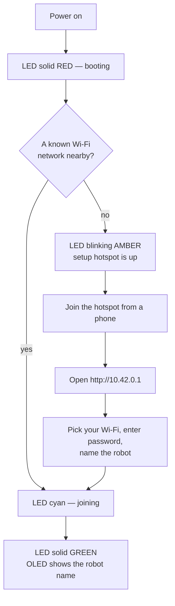

# NavProMini — robot setup guide

Everything needed to take a NavProMini from a box to a robot on your network:
first power-on, the Wi-Fi setup hotspot, what the LED is telling you, and a
one-time install for a robot built from source.

For development, simulation and the ROS launch reference, see [README.md](README.md).
For the HTTP API, see the [SDK docs](https://botforge-robotics.github.io/navpromini_sdk/).

---

## 1. First power-on

A factory robot is already installed. Turning it on runs this sequence by itself:



**Timing, measured on a robot:** systemd finishes booting at ~22 s (3 s kernel +
19 s userspace), with `navpro-display` active at 10 s and `navpro-robot` at 20 s.
Green normally follows within another 10–20 s, once the lidar has spun up, the
ESP32 micro-ROS link has handshaked and Wi-Fi has joined — so **roughly 30–45 s**
from power-on to ready. Add a few seconds on a first boot after an image write.

**Nothing to press.** There is no setup button and no factory-reset combination.
The robot decides between joining a saved network and opening its hotspot by
scanning: if any Wi-Fi profile it has saved is currently in range, it joins that
and never opens the hotspot. Otherwise the hotspot comes up.

That rule is the whole logic. A robot that opens its hotspot in a place it has
worked before is telling you the network is not on the air — not that it forgot
the password.

---

## 2. Reading the LED

The LED is the robot's only always-visible status, so learn these six.

| LED | Meaning | What to do |
|---|---|---|
| 🔴 **Solid red** | Booting | Wait ~30–45 s. Still red after 90 s means the hardware stack failed to start |
| 🟠 **Blinking amber** | Setup hotspot is up, waiting for you | Follow [section 3](#3-connecting-it-to-wi-fi) |
| 🔵 **Solid cyan** | Joining Wi-Fi | Wait ~15 s |
| 🟢 **Solid green** | Ready — on the network, idle or navigation-ready | Nothing |
| 🔵 **Blue chase** | Mapping in progress | Drive it around |
| 🔴 **Blinking red** | Error | See [section 7](#7-when-something-is-wrong) |
| ⚪ **Solid grey** | Offline — ROS stack not reachable | Check `navpro-robot.service` |

**Charging overrides the colour**, whatever else the robot is doing:

| LED | Meaning |
|---|---|
| 🔴 **Breathing red** | Charging |
| 🟢 **Breathing green** | On the charger, fully charged |

Breathing is charging; solid or blinking is not. The charge indication comes
from the battery reporting actual current, not from the docking controller, so
it is equally correct whether the robot drove onto the dock itself or you pushed
it on by hand.

The OLED carries the same state as text: `NavProMini` while booting, the Wi-Fi
hotspot name and password during setup, `Connecting WiFi...`, then **the robot's
own name** once it is ready.

---

## 3. Connecting it to Wi-Fi

When the LED blinks amber, the robot is running its own access point.

### On your phone or laptop

**1. Join the robot's hotspot.**

| | |
|---|---|
| Network | `NavPro-Setup-XXXXXX` |
| Password | `navprosetup` |

`XXXXXX` is the last six characters of the robot's Wi-Fi MAC address, so several
robots in one room each get a distinct name. The OLED shows the exact one.

Your phone will warn that this network has no internet. Stay connected anyway —
that warning is Android and iOS noticing the hotspot is not a route to the
internet, which is correct and expected.

**2. Open the setup page.**

```
http://10.42.0.1
```

Most phones pop it up automatically as a captive-portal sign-in sheet. If not,
type the address — and type `http://`, because browsers default to HTTPS and the
portal is plain HTTP on a link that nobody else can see.

**3. Fill in three fields.**

| Field | Notes |
|---|---|
| **Wi-Fi network** | Pick from the list the robot scanned. Choose *Other* to type a hidden SSID |
| **Wi-Fi password** | The site network's password |
| **Robot name** | What this robot is called — shown on its OLED and in the API |

Use a short, distinct robot name: `bot-1`, `lobby`, `ward-3`. It becomes the
robot's identity everywhere, and renaming later means going through this page again.

**4. Submit and watch.**

The page shows live progress: leaving the hotspot, joining your Wi-Fi, done. Your
phone will drop off the hotspot at the first step — that is the robot shutting it
down, and it means things are working. The page reconnects itself if your phone
returns to the same Wi-Fi you just gave the robot.

The LED goes cyan, then green. The OLED shows the robot's name.

### 2.4 GHz only

The robot's Wi-Fi is 2.4 GHz. If your network is 5 GHz-only, or your access point
is set to steer clients to 5 GHz, the SSID will not appear in the list. Enable a
2.4 GHz band, or use *Other* to type the SSID by hand — it still has to be a
network the radio can actually see.

---

## 4. Finding the robot on your network

Once it is on Wi-Fi you need its IP address. Any of:

- **Your router's client list** — look for the hostname `navpromini`.
- **On the robot**, over a keyboard or SSH: `hostname -I`
- **Scan the subnet** for the API port:
  ```bash
  nmap -p 8090 --open 192.168.1.0/24
  ```

Then confirm it answers:

```bash
curl -s http://<robot-ip>:8090/api/v1/system/info
```

> **Give it a DHCP reservation.** The robot's IP is how everything reaches it —
> the app, the API, SSH. Pin it in your router so it survives reboots. The
> `navpromini.local` mDNS name works on a flat LAN but not across VPNs, routed
> subnets or containers, and when it fails it looks like the robot is down.

### What is listening

| Port | Service | Purpose |
|---|---|---|
| **8090** | `navpro-sdk` | HTTP + WebSocket API ([docs](https://botforge-robotics.github.io/navpromini_sdk/)) |
| **9090** | `navpro-mission-planner` | rosbridge — the NavProMini app speaks this |
| **8081** | `web_video_server` | Camera stream |
| **80** | `navpro-provision` | Setup portal — **only** while the hotspot is up |

---

## 5. Changing the Wi-Fi later

Moving the robot to a different site means giving it that site's network.

**If the old network is out of range**, just power the robot on there. No saved
network is nearby, so the hotspot opens by itself — go to
[section 3](#3-connecting-it-to-wi-fi).

**If both networks are in range**, the robot will keep joining the old one. Delete
that profile over SSH and restart the portal:

```bash
sudo nmcli connection delete "<old-ssid>"
sudo systemctl restart navpro-provision
```

The hotspot comes back within a few seconds.

Saved networks accumulate — a robot that has worked at three sites joins whichever
of the three it sees first. That is usually what you want, and occasionally not.
List them with `nmcli connection show`.

---

## 6. Installing on a robot built from source

Skip this for a factory robot; it is already done. This is for a fresh Raspberry Pi.

### Prerequisites

- Raspberry Pi (64-bit), **ROS 2 Jazzy** installed
- ESP32 flashed with the NavProMini micro-ROS firmware, on the Pi's UART
- RPLidar and the BMS on USB

### Build and install

```bash
git clone git@github.com:botforge-robotics/Nav_Pro_Mini.git ~/NavProMini_ws/src
cd ~/NavProMini_ws
source /opt/ros/jazzy/setup.bash
rosdep install --from-paths src --ignore-src -r -y
colcon build --symlink-install
source install/setup.bash

sudo bash src/navpromini_setup/scripts/install_navpro.sh
```

The installer is idempotent — re-run it after a rebuild. It:

1. Installs NetworkManager and helpers, frees the UART from the serial console,
   and adds the user to `dialout`
2. Adds ROS, micro-ROS and workspace sourcing to the user's `.bashrc`
3. Installs udev rules giving stable device names — `/dev/rplidar` and
   `/dev/battery_bms` — so the stack does not care which USB port is which or
   what order they enumerate
4. Copies the launcher scripts to `/opt/navpro/scripts/`
5. Installs, enables and starts four systemd services

### Then install the SDK service

The API server is a separate unit and is **not** part of `install_navpro.sh`:

```bash
sudo bash ~/NavProMini_ws/src/navpromini_sdk/systemd/install_sdk_service.sh
```

Also idempotent. Without it the API only runs when launched by hand and does not
survive a reboot.

### The services

| Unit | Does | Depends on |
|---|---|---|
| `navpro-display` | OLED + LED status | — |
| `navpro-robot` | micro-ROS agent, lidar, wheel odometry, battery | — |
| `navpro-provision` | Wi-Fi hotspot, only when no known network is near | `navpro-display` |
| `navpro-mission-planner` | rosbridge `:9090` + launch/map services | `navpro-robot` |
| `navpro-sdk` | HTTP/WebSocket API `:8090` | `navpro-robot` (wanted, not required) |

```bash
systemctl status navpro-robot          # one service
journalctl -u navpro-robot -f          # follow its log
sudo systemctl restart navpro-display  # restart one
```

`navpro-sdk` uses `Wants=` rather than `Requires=` on the robot stack on purpose:
a monitoring API that refuses to start because the robot is broken is unavailable
exactly when you need it to tell you what broke.

### Removing it

```bash
sudo bash /opt/navpro/scripts/uninstall_navpro.sh
```

### Files it owns

| Path | Contents |
|---|---|
| `/etc/navpro/robot.yaml` | Robot name, serial, Wi-Fi SSID — written by the setup portal |
| `/opt/navpro/scripts/` | Service launchers and `env.sh` |
| `/run/navpro/display_state` | Current display state (tmpfs, rebuilt each boot) |
| `/var/lib/navpro/maps/` | Saved maps |
| `/etc/udev/rules.d/99-navpro.rules` | `/dev/rplidar`, `/dev/battery_bms` |

---

## 7. When something is wrong

### The LED never leaves red

The hardware stack did not come up.

```bash
systemctl status navpro-robot
journalctl -u navpro-robot -n 50
```

Usually the ESP32 is not talking over UART, or the lidar did not enumerate:

```bash
ls -l /dev/rplidar /dev/battery_bms     # both should be symlinks to ttyUSB*
ros2 topic hz /joint_states             # ESP32 alive?
ros2 topic hz /scan                     # lidar alive?
```

A missing `/dev/rplidar` with a present `/dev/ttyUSB*` means the udev rule did not
match — a different lidar dongle. Check `udevadm info -a -n /dev/ttyUSB0 | head -20`
for its vendor/product ID and add it to `99-navpro.rules`.

### The hotspot never appears

```bash
systemctl status navpro-provision
journalctl -u navpro-provision -n 50
nmcli device status                     # is wlan0 managed?
```

The most common cause is that the robot **did** find a known network and joined it
silently — which is correct behaviour, not a fault. Check with `nmcli connection show --active`.

### It joined Wi-Fi but nothing can reach it

```bash
curl -s http://<robot-ip>:8090/api/v1/system/health
```

If that answers, the robot is fine and the problem is between you and it — client
isolation on the access point (common on guest networks), a firewall, or a VPN
sending your traffic elsewhere.

If it does not answer but SSH does, the SDK service is not installed or not
running — see [section 6](#6-installing-on-a-robot-built-from-source).

### The OLED is stuck showing setup

The display node cross-checks this: if the hotspot is not actually up, it moves
itself to `ready`. Being stuck means the hotspot really is still running, which
means the Wi-Fi join failed. Reconnect to the hotspot and check the password.

### Maps disappeared after a rebuild

Maps live inside the ROS install tree, so a clean rebuild can remove them. Copy
anything you care about off the robot — they are plain `.yaml` + `.pgm` pairs.

---

## 8. Hardware reference

| Item | Value |
|---|---|
| Drive | Differential, two powered wheels + casters |
| Wheel radius | 0.0325 m (65 mm diameter) |
| Wheel separation | 0.225 m |
| Encoder | 1470 ticks/rev (≈7198.7 ticks/m) |
| Lidar | RPLIDAR A1M8 → `/scan`, frame `lidar_1` |
| IMU | QMI8658 → `/imu`, frame `imu_link` |
| Camera | USB, rear-facing, 1280×720 @ 15 fps — used for dock detection |
| Battery | 4S Li-ion, ~14 V nominal, Daly BMS over RS485 |
| Charging | Contact dock, AprilTag 36h11 on the dock face |
| Compute | Raspberry Pi (64-bit) + ESP32 over UART |
| Max speed | 0.135 m/s linear, 0.337 rad/s angular (Nav2 limits) |
| Footprint | 0.16 m radius |

---

## 9. Next steps

- **Drive it** — the NavProMini app connects to `<robot-ip>:9090`
- **Map a space** — [`POST /mode {"mode": "mapping"}`](https://botforge-robotics.github.io/navpromini_sdk/getting-started/#4-make-a-map)
- **Automate it** — the [SDK](https://botforge-robotics.github.io/navpromini_sdk/) drives the robot over plain HTTP
- **Develop on it** — [README.md](README.md) covers simulation, launch files and multi-machine RViz
