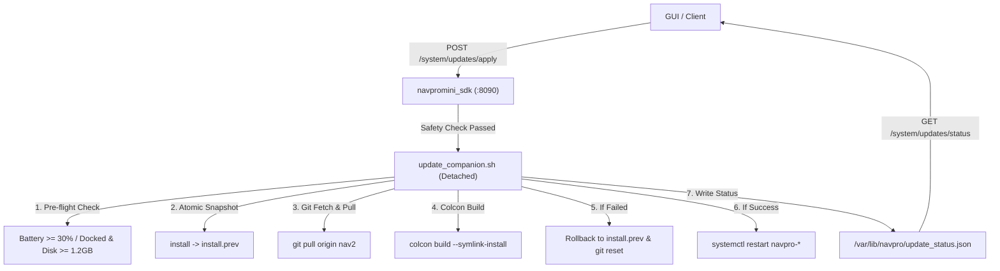

# NavPro Mini Companion Software — OTA Update & Release Guide

This document describes the design, safety guarantees, versioning, and operation of the **Over-The-Air (OTA) Software Update System** on the robot companion computer (Raspberry Pi / SBC).

---

## 1. System Architecture

Updates are managed by the detached background worker script:
`/opt/navpro/scripts/update_companion.sh`
which is triggered remotely via the NavPro Mini SDK HTTP API:
`POST /api/v1/system/updates/apply`

---

## 2. Strict Safety Interlocks (Pre-Flight Checks)

An update will **NEVER** be applied unless ALL of the following safety conditions are met:
1. **Motion Lock**: Robot speed must be $< 0.05\text{ m/s}$ (both linear and angular velocity).
2. **Activity Lock**:
   - Mapping mode (`/mode`) must NOT be active.
   - Mission runner must be idle (no active navigation goals or routines).
3. **Power Lock**: Battery must be $\ge 30\%$ OR robot must be actively docked on its charger.
4. **Storage Lock**: Root filesystem (`/`) must have at least $1.2\text{ GB}$ of free disk space.

If any check fails, the API immediately rejects the request with HTTP `409 Conflict` and a list of blocking conditions.

---

## 3. Atomic Snapshot & Rollback Mechanics

To prevent the robot from ever bricking or failing to boot after a bad commit:
1. **Pre-build Snapshot**:
   Before compilation begins, the worker creates an instant hard-link backup:
   `cp -al /home/navpromini/NavProMini_ws/install /home/navpromini/NavProMini_ws/install.prev`
   and records the current stable Git commit hash (`PREV_COMMIT`).
2. **Error Trap**:
   If any command fails (`git`, `colcon build`, or script error):
   - The script automatically executes its `EXIT` error trap.
   - Restores the working build: `rm -rf install && cp -al install.prev install`.
   - Resets Git: `git reset --hard $PREV_COMMIT`.
   - Restarts the robot services into the known-good build.
   - Services are **NEVER** restarted into a broken build.

---

## 4. Power-Loss Boot Recovery

If physical power is disconnected or the battery dies during an active `colcon build`:
- On the next boot, `/opt/navpro/scripts/env.sh` runs before any ROS 2 nodes start.
- If `install/setup.bash` is missing or incomplete, `env.sh` automatically detects the snapshot at `install.prev` and restores it immediately.
- The robot always boots cleanly into its last stable state.

---

## 5. Endpoints Reference

| Method | Endpoint | Description |
|---|---|---|
| `GET` | `/api/v1/system/updates` | Checks local commit vs remote git commit, commits behind, changelog, and safety status |
| `POST` | `/api/v1/system/updates/check` | Triggers background `git fetch origin` |
| `POST` | `/api/v1/system/updates/apply` | Verifies safety interlocks and launches detached updater |
| `GET` | `/api/v1/system/updates/status` | Returns live phase (`idle`, `pulling`, `building`, `restarting`, `success`, `failed`) and log tail |

---
*OTA Update Verified: NavPro Companion v2.0.0+*
